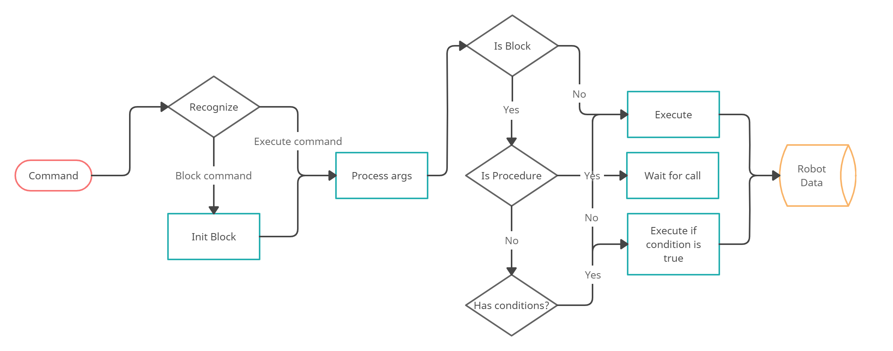

<p align="center">
    <br>
      
      <h1 align="center">LangLine</h1>
    <br>
<p>
	
<b> LangLine <b> — Это пакет языка программирования на базе C#, разработанный специально для управления движением исполнителя по двумерной сетке. Этот язык был создан в рамках учебных целей, ориентированных на обучение программированию и робототехнике. LangLine идеально подходит для обучения основам алгоритмизации и разработки программных систем.
  
## Установка
Пакет опубликован в системе управления пакетами NuGet, вы установить его:
- Через диспетчер пакетов Visual Studio:
  	> Во вкладке "Установка" наберите в поиск "LangLine" и скачайте последнюю версию пакета.
- Через консоль диспетчера пакетов Visual Studio:
  	> В консоли диспетчера пакетов пропишите следующую команду:
   ```
	NuGet\Install-Package LangLine
   ```
- Установить весь пакет через консоль:
	> Откройте консоль в папке проекта и введите следующую команду:
  ```
	nuget install LangLine
   ```
- Установить его с NuGet.org:
  	> Перейдите по [ссылке](https://www.nuget.org/packages/LangLine/) и установите пакет.


## Функции LangLine:
`DOWN N` - Переместить исполнителя на N клеток вниз.

`UP N` - Переместить исполнителя на N клеток вверх.

`LEFT N` - Переместить исполнителя на N клеток влево.

`RIGHT N` - Переместить исполнителя на N клеток вправо.

`IFBLOCK DIR` - Проверить препятствие в направлении DIR (RIGHT, LEFT, UP, DOWN). Препятствием являются края сетки. Если есть препятствие, выполнить следующие команды до ENDIF.

`ENDIF` - Завершить блок команд после IFBLOCK DIR.

`PROCEDURE NAME` - Начать определение процедуры* с заданным именем.

`ENDPROC` - Завершить определение процедуры.

`CALL NAME` - Вызвать ранее определенную процедуру по имени.

`SET X = N` - Задать значение переменной X равным N.

`REPEAT N` - Повторить следующую команду (или блок команд до ENDREPEAT) N раз.

`ENDREPEAT` - Завершить блок команд после REPEAT N.

## Архитектура

### Обработка команды LangLine

<p align="center">
    <br>
      
    <br>
<p>

На вход интерпретатора приходит команда, которая обрабатывается по следующему алгоритму:

1) Распознавание команды: Блок-команда или команда выполнения (В случае встречи с блок-командой происходит обработка вложенных в него команд).
2) Обработка аргументов для команды: Обработка аргументов и обработка ошибок (в случае неверного формата).
3) Выполнение команды:
   a) Если команда - блок-команда, то проверка на процедуру, иначе запуск команды.
   b) Если блок-команда - процедура, то запись команды в список объявленных процедур, иначе проверка на условия.
   c) Если блок-команда имеет условия - запуск при их соблюдении, иначе запуск блок-команды.
4) Обработка результатов: Трассировка ошибок, передвижения исполнителя.

